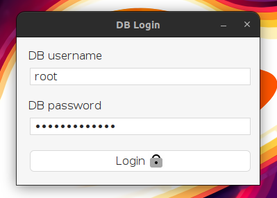

# FOREIGN CRUD

## Usage

### DB Login 

Enter your database login credentials in the required fields and click on the `Login` button.



> [!INFO]
> The default username is `root` and the password is empty, but if you have changed it, enter your credentials.

## Dir Structure

```bash
.
├── db
│   └── foreign_crud.sql
├── src
    └── main
        ├── java
        │   └── com
        │       └── n3vers4ydie
        │           └── foreigncrud
        │               ├── connection
        │               │   └── DB.java
        │               ├── dao
        │               │   ├── CategoryDAO.java
        │               │   └── ProductDAO.java
        │               ├── Main.java
        │               ├── model
        │               │   ├── Category.java
        │               │   └── Product.java
        │               └── view
        │                   ├── CategoriesPanel.form
        │                   ├── CategoriesPanel.java
        │                   ├── ForeignsPanel.form
        │                   ├── ForeignsPanel.java
        │                   ├── LoginView.form
        │                   ├── LoginView.java
        │                   ├── MainView.form
        │                   ├── MainView.java
        │                   ├── ProductsPanel.form
        │                   └── ProductsPanel.java
        └── resources
            ├── add.png
            ├── auto-sql-crud-1.0.jar
            ├── clear_filter.png
            ├── clear.png
            ├── delete.png
            ├── filter.png
            ├── login.gif
            ├── search.png
            └── update.png
```
